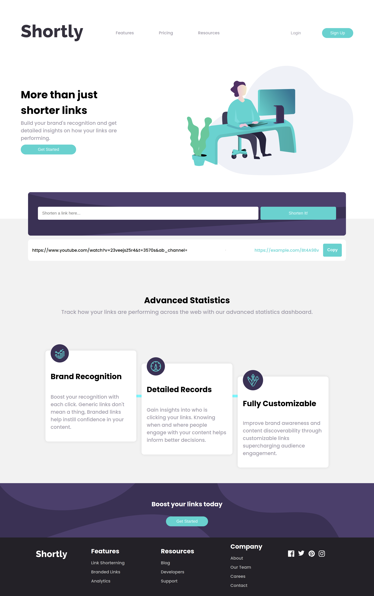

# Frontend Mentor - Shortly URL shortening API Challenge Solution

This is a solution to the [Shortly URL shortening API Challenge challenge on Frontend Mentor](https://www.frontendmentor.io/challenges/url-shortening-api-landing-page-2ce3ob-G). Frontend Mentor challenges help you improve your coding skills by building realistic projects.

## Table of Contents

- [Overview](#overview)
  - [The Challenge](#the-challenge)
  - [Screenshot](#screenshot)
  - [Links](#links)
- [My Process](#my-process)
  - [Built With](#built-with)
  - [What I Learned](#what-i-learned)
  - [Continued Development](#continued-development)
  - [Useful Resources](#useful-resources)
- [Author](#author)
- [Acknowledgments](#acknowledgments)

## Overview

### The Challenge

Users should be able to:

- View the optimal layout for the site depending on their device's screen size
- Shorten any valid URL
- See a list of their shortened links, even after refreshing the browser
- Copy the shortened link to their clipboard in a single click
- Receive an error message when the `form` is submitted if:
  - The `input` field is empty

### Screenshot

### Links

- Solution URL: [URL form Coding](https://github.com/gabriel-rocha-pimentel/front-end-mentor-projects/url-shortener)
- Live Site URL: [Shortner Link URL](https://your-live-site-url.com)

## My Process

### Built With

- Semantic HTML5 markup
- CSS custom properties
- Python Language
- Javascript Language
- Flexbox
- CSS Grid
- Micro Framework Flask
- Mobile-first workflow
- [Styled Components](https://styled-components.com/) - For styles
- **ChatGPT** - AI assistance for learning and project guidance

### What I Learned

During the development of this project, I had the opportunity to explore and work with various technologies. One significant aspect of my learning journey was integrating **ChatGPT** into my workflow. This AI played a pivotal role as a guide, mentor, and source of knowledge, helping me bridge the gap in my understanding, especially in areas like AI and databases. It empowered me to tackle an intermediate-level project successfully.

I've gained valuable experience in AI and its practical applications, thanks to this project, and I look forward to further improving my skills in this domain.

### Continued Development

Use this section to outline areas that you want to continue focusing on in future projects. These could be concepts you're still not completely comfortable with or techniques you found useful that you want to refine and perfect.

## Author

- Website - [GitHUb - gabriel-rocha-pimentel](https://www.your-site.com)
- Frontend Mentor - [@gabriel-rocha-pimentel](https://www.frontendmentor.io/profile/gabriel-rocha-pimentel)

## Acknowledgments

I'd like to express my gratitude to **ChatGPT** for its invaluable assistance throughout this project. As a junior developer, I embarked on an intermediate-level challenge with confidence, thanks to the guidance and support provided by this AI. It helped me overcome my limitations in areas such as AI and databases and played a pivotal role in the successful completion of this project. The project's accomplishment stands as a testament to how AI can enhance the learning process and empower individuals to achieve their goals.
